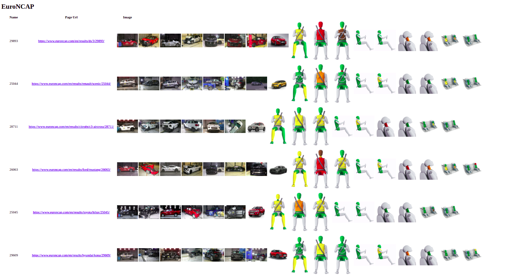

# Summary about the project

<!-- TABLE OF CONTENTS -->
<details>
  <summary>Table of Contents</summary>
  <ol>
    <li><a href="#overview">overview</a></li>
    <li><a href="#instructions-to-Run-this-repository">Instructions to Run this repository</a></li>
    <li>
      <a href="#how-to-create-the-template">How to create the template</a>
      <ul>
        <li><a href="#create-documented-code">Create documented code</a></li>
        <li><a href="#setup-sphinx-project">Setup sphinx project</a></li>
        <li><a href="#configure-sphinx-documentation-builder">Configure sphinx documentation builder</a></li>
        <li><a href="#configure-the-`.rst`-files">Configure the `.rst` files</a></li>
        <li><a href="#Build-the-documentation-in-HTML-and/or-Latex">Build the documentation in HTML and/or Latex</a></li>
      </ul>
    </li>
    
  </ol>
</details>


<!-- Overview -->
# Overview
This project uses the neo4j graph from the [project](https://github.com/Ganesamanian/Graph-modeling-with-car-crash-attributes). This project publishes the data from neo4j to webpage using Django template. 

<p align="right">(<a href="#top">back to top</a>)</p>


<!-- Instructions to Run this repository -->
# Instructions to Run this repository
1. Clone [this](https://github.com/Ganesamanian/Publishing-webpage-using-Django-Template-from-Neo4j) repository using 
   ```
   git clone https://github.com/Ganesamanian/Publishing-webpage-using-Django-Template-from-Neo4j.git
   ```
2. Install the following packages using `pip`.
   ```
   pip install django
   pip install django_neomodel
   pip install python
   pip install neo4j
   ```
3. Navigate inside the folder and run the server.

   ```
   python manage.py runserver
   ```
4. Before that you should run the neo4j graph
   ```
   neo4j start
   ```
5. Change the bolt credentials to your neo4j's credentials, then run the file feedthekg.py
 ```
   python feedthekg.py
   ```

<p align="right">(<a href="#top">back to top</a>)</p>


<!-- How to create the template -->
# How to create the template
This section doesn't deal with how to create basic template, but explains how the template of this project has been created.

1. Assuming you have django project, if not follow the procedure [here](https://github.com/Ganesamanian/Graph-modeling-with-car-crash-attributes/blob/master/Document/Django.pdf)

2. Navigate inside the app folder, in this case its `myapp`.

3. Open views.py file copy the below code block   
   
   
    ```python
    from django.shortcuts import render
	from django.http import HttpResponse
	from django.views import generic
	from myapp.models import *
	from neomodel import db
	from itertools import chain


	def home(request):
	    
	    return render(request, 'myapp/home.html')
	    
	def about(request):
	    
	    return render(request, 'myapp/about.html')


	class tableview(generic.ListView):
	    template_name = 'myapp/home.html'
	    context_object_name = 'run_list'

	    def get_queryset(self):

		all_nodes = Page.nodes.all()
		query_page = list(chain.from_iterable(db.cypher_query("MATCH (n:Page) RETURN n.page_uid")[0]))
		query_resultpage = list(chain.from_iterable(db.cypher_query("MATCH (n:Resultpage) RETURN n.resultpage_uid")[0]))
		uid = query_page + query_resultpage
		
		url_list = []
		name_list = []
		image_list_t = []
		image_list_ao = []
		image_list_pd = []
		image_list_sf = []
		image_list = []


		# for uid1 in query_page:
		#     url_list.append(Page.nodes.get(page_uid = uid1).page_url)
		#     name_list.append(Page.nodes.get(page_uid = uid1).page_name)


		for uid2 in query_resultpage:
		    url_list.append(Resultpage.nodes.get(resultpage_uid = uid2).resultpage_url)
		    name_list.append(Resultpage.nodes.get(resultpage_uid = uid2).resultpage_name)
		    image_list_t.append(Resultpage.nodes.get(resultpage_uid = uid2).resultpage_test_image_url)
		    image_list_pd.append(Resultpage.nodes.get(resultpage_uid = uid2).resultpage_pedestrain_image_url)
		    image_list_ao.append(Resultpage.nodes.get(resultpage_uid = uid2).resultpage_adultoccupant_image_url)
		    image_list_sf.append(Resultpage.nodes.get(resultpage_uid = uid2).resultpage_safety_image_url)

		for count in range(len(image_list_t)):
		    image = image_list_t[count]+image_list_pd[count]+image_list_ao[count]+image_list_sf[count]   
		    strings_ = image.replace("[", "")
		    strings_ = strings_.replace("]", "")
		    strings_ = strings_.replace("\'", "")
		    letter_list = strings_.split(",")        
		    image_list.append(letter_list)

		run_list=zip(name_list, url_list, image_list)
		
		return run_list
    ```
 
 4. The above code block used to render the data from neo4j to webpage in table format, alos it process the pages about and home.
 
 5. Now open urls.py from the same path and copy the below code block
 
 ```python
        from django.urls import path
	from . import views

	
	app_name = 'myapp'

	urlpatterns = [
	    path(
		'',
		views.tableview.as_view(), name='tableview'
		),

	]
    ```
 5. The above code block used to redirect the url to the tableview class in views.py
 
 6. Now navigate back to `myproject`, inside that open urls.py and copy the below code block
 
  ```python
        from django.contrib import admin
	from django.urls import path, include

	urlpatterns = [
	    path('admin/', admin.site.urls),
	    path('Myapp/', include('myapp.urls')),
	]
    ```
    
7. This used to provide two pages or links for the webpage where the Myapp link redirects to urls.py in the app folder which in turn projects the webapge.

8. Once the above codings are done run the server inside the `myproject` folder 

   ```
   python manage.py runserver
   ```

9. Now you can view the webpage in your localhost as `localhost:8000/Myapp/`


10. The webpage should look as below



<p align="right">(<a href="#top">back to top</a>)</p>
